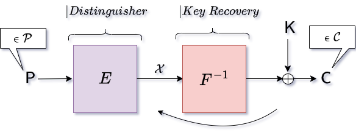

---

Title: "Partial Sums Meet FFT: Improved Attack on 6-Round AES"
Implementation: Shibam Ghosh
Published At: "Eurocrypt 2024"
Full Version: "https://eprint.iacr.org/2023/1659"

---

  

This repository contains the implementation of the key recovery attacks presented in our paper:

-[Partial Sums Meet FFT: Improved Attack on 6-Round AES](https://eprint.iacr.org/2023/1659),
Orr Dunkelman, **Shibam Ghosh**, Nathan Keller, Gaetan Leurent, Avichai Marmor, Victor Mollimard.

To compare with the previous best-known attacks against 6-round AES, we also 
implement the [Partial-Sum Technique](https://link.springer.com/chapter/10.1007/3-540-44706-7_15) 
proposed by Ferguson et al. and [FFT-based attack](https://eprint.iacr.org/2014/187) proposed 
by Todo et al. 

## Table of contents

---

1. [Generic Structure](#generic-structure)
2. [Requirements](#requirements)
3. [Attack On AES](#attacks-on-aes)
4. [Attacks On small-scale AES](#attacks-on-small-aes)
    <!-- 1. [Basic Attack](#basic-attack) -->
    <!-- 2. [Basic Attack](#basic-attack) -->
    <!-- 3. [Basic Attack](#basic-attack) -->
    <!-- 4. [Basic Attack](#basic-attack) -->

---

## Generic Structure

The implementation of the attacks is primarily on the 6-round AES cipher. However, to test 
the results quickly and understanding, the same attack algorithms are also implemented on 
[small-scale AES](https://link.springer.com/chapter/10.1007/11502760_10). This small-scale
version of AES was proposed by Murphy et al. in FSE 2005. The location of the ciphers in the 
repository is as follows:

- [Attacks on 6-round AES](aes)
- [Attacks on 6-round small-scale AES](small_aes)

The root directory includes a highly optimized implementation of the Fast Hadamard 
Transformation, developed in [FFHT](https://github.com/FALCONN-LIB/FFHT). It is important 
to mention that in our scenario, we utilize the Hadamard Transformation, which belongs to 
a broader category, called Fourier Transformations. Therefore, we specifically employ 
FHT (Fast Hadamard Transformation). However, for the sake of consistency with literature 
on 'FFT-based attacks', we refer to it as FFT (Fast Fourier Transformation) instead of 
FHT (Fast Hadamard Transformation).

Each attack directory contains a makefile.

## Requirements
    GCC >= 11.4
    AES-NI (For AES Oracle only, the attack does not need AES-NI.)
## Attacks On AES

The directory for [AES](aes) contains the implementations of the following attacks  

- [Basic Attack](aes/algorithm3) contains the implementation of the basic attack
on AES that we proposed in Algorithm 3 of our paper.

- [Low Memory Variants](aes/algorithm4) contains the implementation of the 
low memory variant of the basic attack on AES that we proposed in 
Algorithm 4 of our paper.

- [Low Memory Variants Without Packing](aes/algorithm4_no_packing) contains the
  implementation of the low memory variant of the basic attack (Algorithm 4) on AES,
  without packing multiple FFTs in 64-bit words.

- [Partial Sum Technique](aes/partial_sum) contains the implementation of the 
[Partial-Sum Technique](https://link.springer.com/chapter/10.1007/3-540-44706-7_15)
proposed by Ferguson et al., on AES.

- [FFT-based Attack](aes/TODOs_ATTACK) contains the implementation of the 
[FFT-based attack](https://eprint.iacr.org/2014/187) proposed by Todo et al. on
AES.

Each of the above directories contains a makefile and a main.c file. In main.c, we generate 
random plaintexts and key for the oracle. The AES oracle is given in [utility](aes/utility).
For this, we use 
[AES-NI](https://www.intel.com/content/www/us/en/developer/articles/technical/advanced-encryption-standard-instructions-aes-ni.html)
instruction set.

## Attacks On small AES

In addition to the attack on AES, we also implement the attacks on small-scale AES in the 
directory [small AES](small_aes). It contains the implementations of the following 
attacks  

- [Basic Attack](small_aes/algorithm3) contains the implementation of the basic attack
on small-scale AES that we proposed in Algorithm 3 of our paper.

- [Low Memory Variants](small_aes/algorithm4) contains the implementation of the 
low memory variant of the basic attack on small-scale AES that we proposed in 
Algorithm 4 of our paper.

- [Low Memory Variants Without Packing](small_aes/algorithm4_no_packing) contains the
  implementation of the low memory variant of the basic attack (Algorithm 4) on
  small-scale AES, without packing multiple FFTs in 64-bit words.

- [Partial Sum Technique](small_aes/partial_sum) contains the implementation of the 
[Partial-Sum Technique](https://link.springer.com/chapter/10.1007/3-540-44706-7_15).

- [FFT-based Attack](small_aes/TODOs_ATTACK) contains the implementation of the 
[FFT-based attack](https://eprint.iacr.org/2014/187).

Each of the above directories contains a makefile and a main.c file. In main.c, we generate 
random plaintexts and keys for the oracle. The implementation of small-scale AES is given
in [utility](small_aes/utility).
